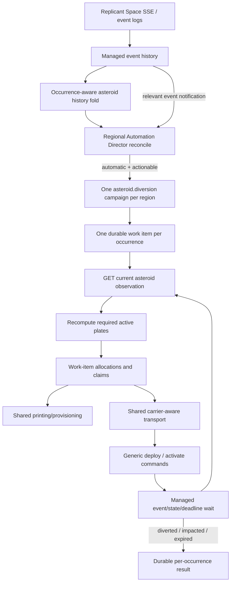

# Asteroid Diversion Automation Director Goal

## Context

Plan an Automation Director capability that treats managed `system.object_detected` history as authoritative, creates exactly one durable diversion operation per actionable detection, and re-evaluates time-sensitive capacity until the object reaches a terminal state. This is the second substrate test after Salvage Recovery: the implementation must use the normal Director, workflow, event, claim, printing, transport, wait, checkpoint, protocol, and regional UI paths rather than asteroid-only infrastructure. The pinned Replicant Space 2.5.2 corpus and current code determine all command and payload semantics; historical behavior remains evidence only where the corpus is silent.

## Executive verdict

**YELLOW, cheap after three focused gaps.** The current substrate already has the event vocabulary and payload, full managed event-history reads, an incoming-object projection, generic Propulsor commands, printing with recursive components, carrier-aware transport, work-item allocations and exact resource claims, durable campaign checkpoints, event/state/deadline waits, regional Director reconciliation, generic protocol summaries, and data-driven regional UI cards. Asteroid Diversion should therefore be a normal disabled-by-default regional Director goal backed by one durable regional campaign and per-occurrence work items.

Three gaps must be fixed rather than bypassed: `(realm, designation)` currently collapses repeated object designations; managed state does not type the documented current asteroid fields needed for sizing; and managed events do not immediately wake the Director. Fix these with an occurrence-aware runtime history fold/parser plus one shared managed-event-to-Director notification; retain the 30-second Director sweep as recovery. No asteroid daemon, scheduler, printer, transport planner, or resource allocator is justified.

## Repository evidence

- `src/events.rs:387-403` defines `SystemObjectDetectedPayload`; `src/events.rs:406-440` retains the opaque event ID/cursor and event timestamp. `src/raw/vocab.rs:96-104` registers `system.object_detected` and all five documented `diversion.*` events.
- `reference/replicant-space-2-5-2/api/events/catalogue/index.md:361-432,1071-1087` defines detection plus activated, deactivated, diverted, impacted, and partial lifecycle evidence. There is no named expiry/missed/failure event; `partial` explicitly still poses a threat.
- `reference/replicant-space-2-5-2/api/locations/asteroids/index.md:13-64` defines `GET /v1/locations/{code}`, the current object fields (`active_plates`, `current_thrust_per_hour`, `impact_eta`, `impact_likelihood`, `impact_target`, `progress_pct`, `required_strength`, `size_class`, `status`), generic deploy/activate mechanics, stacking mining reward, and the beacon hint. It says required strength scales with size and proximity, but does not state a universal one-thrust-per-hour plate rate or the sizing formula.
- `src/managed/events/projection.rs:231-354` projects detection/diversion events into `IncomingObject`; `src/domain/model.rs:469-492` models `Detected`, `DiversionActive`, `Partial`, `Diverted`, and `Impacted`. The projection key is only realm plus designation and a later same-designation detection resets it to `Detected`, so it cannot be the durable occurrence identity.
- `src/managed/store.rs:1148-1255,2045-2063` deduplicates journal entries by event ID and reads applied history; `src/managed/events.rs:169-273` exposes history queries; `Client::events().full_history_named`, used by `salvage_recovery_history_snapshot` in `crates/replicant-runtime/src/automation.rs:1420-1506`, is the established remote-history-authority pattern for objects that disappear from ordinary projections.
- `src/raw/locations.rs:98-182,277-289` retains the location `object` as open JSON and provides the exact location read; `RawResponse<T>.value` is the decoded payload (`src/raw/client.rs:75-82`). No typed incoming-asteroid observation exists. `src/raw/devices.rs:438-540,647-719` models the contract's generic deploy, activate, deactivate, attach/detach, print, and command observables. `src/domain/vocab.rs:150-184` includes `Propulsor`.
- `crates/replicant-printing/src/managed.rs:165-260` provides blueprint discovery, recursive component printing, queueing, and completion status. `crates/replicant-transport/src/lib.rs:91-110,179-220,324-430` revalidates and executes generic carrier attachment, travel, and detachment. Exact Propulsor cost/time/capacity is account-blueprint state, not a constant in 2.5.2.
- `crates/replicant-runtime/src/assignment.rs:49-193` discovers device and quantity-bearing inventory candidates and atomically allocates work-item requirements. `crates/replicant-runtime/src/automation.rs:5656-5687` supplies exact device and namespaced target claims.
- `crates/replicant-workflow/src/work.rs:131-177` persists per-item dedupe keys, resource requirements, explicit deadlines, checkpoints, and retry times. `WorkflowContext::wait_until` in `crates/replicant-workflow/src/supervisor.rs:221-319` durably combines event names/cursor recovery, state revisions, an absolute deadline, and fallback polling.
- `reconcile_salvage_recovery` (`crates/replicant-runtime/src/orchestration.rs:3224-3429`) and `reconcile_event_completion` (`:3432-3560`) establish regional discovery, adoption, `create_or_reuse_active`, advisory/automatic behavior, and summary semantics. Event campaign registration/checkpoint/work-item/wait patterns are in `crates/replicant-runtime/src/automation.rs:181-222,758-790,4263-4512`.
- `DirectorGoalKind`/`DirectorGoalStatus` are in `crates/replicant-protocol/src/lib.rs:213-253`. Runtime registries are `default_goal_enabled`, `initial_goal_objective`, `all_goal_kinds`, `goal_kind_key`, `parse_goal_kind`, and `goal_is_regional` in `crates/replicant-runtime/src/orchestration.rs:5420-5505`; UI parsing/labels are `apps/web/src/protocol.ts:146-157,4169-4182` and `apps/web/src/AutomationsPage.tsx:1340-1352`.
- `run_director` (`crates/replicant-server/src/lib.rs:6172-6198`) currently wakes only every 30 seconds or after a control change. The same server already watches managed events/state in `run_trigger_engine` (`:865-913`) and managed revisions in `run_supervisor` (`:629-824`), so notification can be shared instead of adding a process.
- `crates/replicant-runtime/Cargo.toml:10-29` already has the direct `sha2` dependency used for deterministic runtime hashing; occurrence IDs require no new dependency.

## Proposed architecture

The scope is **regional work discovered from the account-wide event stream**. Resolve the impact target to a catalogue system and canonical region; only that region's `AsteroidDiversion` goal may adopt/create work. The Director owns candidate discovery, enable/mode policy, campaign adoption, and summaries. The campaign owns occurrence refresh, deadline arithmetic, allocations/claims, printing, delivery, commands, checkpoints, and terminal proof.

Use one `asteroid.diversion` regional campaign with work items rather than one Director workflow per event. This matches Event Completion for batching and Salvage Recovery for history authority, while allowing multiple simultaneous objects in one region without duplicate strategic records. The Director never calculates plates or issues commands.

## Detailed implementation phases

### 1. Hold the Salvage Recovery substrate gate

- Before asteroid edits, run `cargo test -p replicant-runtime salvage_recovery` and `cargo test -p replicant-runtime --test workflow_restart` from the repository root. These prove the just-integrated history-authority, Director adoption, checkpoint, and restart paths remain healthy.
- If either command fails, stop Asteroid Diversion work and repair/land Salvage Recovery first. Do not weaken or bypass those contracts to continue this feature.

### 2. Add occurrence-aware asteroid authority and observation

- Add `crates/replicant-runtime/src/asteroid_diversion.rs` and register the module in `crates/replicant-runtime/src/lib.rs`. Keep history folding, typed current-observation parsing, sizing, and the workflow in this domain module so `automation.rs` receives only factory registration and shared-helper visibility changes.
- Define `AsteroidOccurrenceId(String)`, `AsteroidOccurrence`, `AsteroidHistorySnapshot`, `AsteroidLifecycle`, `AsteroidObservation`, and typed parse/sizing errors. Expose crate-local:
  - `async fn asteroid_history_snapshot(client: &Client, now_ms: i64) -> Result<AsteroidHistorySnapshot, String>`;
  - `async fn observe_asteroid(client: &Client, occurrence: &AsteroidOccurrence) -> Result<AsteroidObservation, AsteroidObservationError>`;
  - `fn required_active_plates(observation: &AsteroidObservation, now_ms: i64) -> Result<u64, AsteroidSizingError>`.
- Build the snapshot from `Client::events().full_history_named` for `system.object_detected` plus `diversion.activated`, `diversion.deactivated`, `diversion.partial`, `diversion.diverted`, and `diversion.impacted`. Sort by the managed event ordering/cursor; never consult the ordinary current-locations projection to discover opportunities.
- Parse the documented current fields from `client.raw().locations().get(designation, None).await?.value.object` without changing the generic raw `Location.object` wire type. Require designation and impact target to match the occurrence; when both event and current ETAs are timezone-aware, require them to represent the same instant, otherwise retain the event ETA only as identity evidence and use the timezone-aware current ETA for arithmetic. Preserve `active_plates`, `current_thrust_per_hour`, `progress_pct`, `required_strength`, `impact_likelihood`, `size_class`, and status. Missing/malformed required fields block only that occurrence; other regional items continue.
- Keep the existing designation-keyed managed projection for compatibility and UI inspection. The occurrence-aware history fold fixes automation identity without a SQL migration or a breaking `IncomingObjectKey` cutover.

### 3. Add the normal durable diversion campaign

- In `asteroid_diversion.rs`, define `asteroid_diversion_workflow_kind() -> WorkflowKind` with literal `asteroid.diversion`, `AsteroidDiversionIntent { region: String, home: String }`, `AsteroidDiversionCheckpoint`, `AsteroidDiversionItemPayload`, `AsteroidDiversionItemCheckpoint`, `AsteroidDiversionStage`, and the constructor/matcher used by the Director. Register its factory only in `register_workflows` in `crates/replicant-runtime/src/automation.rs`.
- Reconcile one work item per `AsteroidOccurrenceId`. Use `dedupe_key = \"divert:<occurrence-id>\"`, a deterministic sort key led by `impact_eta`, and `WorkItemSpec.deadline_at_ms = impact_eta`. Reconciliation may add a newly detected occurrence to a still-active regional campaign, but must never replace or duplicate an existing item.
- Persist the immutable occurrence record, latest accepted observation, claimed/printed Propulsor codes, delivery/deploy/activation completion sets, deterministic print tag, and terminal outcome. Persist before each mutating command and after each authoritative observation; derived plate demand is diagnostic only and must be recomputed rather than trusted after restart.
- Keep reservation layers distinct. `ResourceBroker::allocate*` creates durable work-item allocations for quantity-bearing inventory/material requirements and selected device/Autofactory candidates; those allocations remain tied to `WorkItemId` across `Waiting` and close with the terminal item transition. Before any side effect, the workflow separately calls `WorkflowContext::acquire_claim` for namespaced occurrence scope and exact `ResourceKey::Device(code)`/`ResourceKey::Autofactory(code)` resources; exact claims survive restart and release at terminal/cancel. Use `queue_prints_with_components`, `printing_status_in_system`, `plan_delivery`, and `execute_delivery`; no asteroid-specific manufacturing, carrier, or transport code.
- Reuse `automation.rs` helpers `wait_for_campaign_work`, `campaign_retry_deadline`, `EVENT_CAMPAIGN_DEPENDENCY_EVENT_NAMES`, and `EVENT_DEPENDENCY_RECONCILIATION_INTERVAL` by making only those symbols `pub(crate)`. The asteroid wait set is that existing dependency list plus exactly `system.object_detected`, `diversion.activated`, `diversion.deactivated`, `diversion.partial`, `diversion.diverted`, and `diversion.impacted`; it also wakes on managed state revisions and impact ETA. Translate the earliest work-item retry into the `WaitIntent` deadline through `campaign_retry_deadline`. The existing 60-second interval is bounded authoritative re-observation, not busy polling; no workflow-supervisor schema or scheduler change is required.

### 4. Add the regional Director contract and immediate event wake

- Add `DirectorGoalKind::AsteroidDiversion` to `crates/replicant-protocol/src/lib.rs`; its exact serde/key/URL literal is `asteroid_diversion`. Keep protocol version 1 because the additive goal uses the existing generic snapshot/control shape.
- In `crates/replicant-runtime/src/orchestration.rs`, add it to every exhaustive registry, classify it regional, default it disabled, and use objective literal `Divert incoming asteroids threatening regional systems`. Add `GoalWorkIdentity::AsteroidDiversion { region, occurrences: BTreeSet<String> }` and `PRIORITY_ASTEROID_DIVERSION: u32 = 800`, below region establishment and above ordinary event completion.
- Load one `AsteroidHistorySnapshot` per Director pass, partition actionable occurrences by the impact target's catalogue system/canonical region, and call `reconcile_asteroid_diversion` for established regional goal instances. Follow `reconcile_salvage_recovery`: prune/adopt compatible nonterminal campaigns, retain permanent failure only for the exact work identity, and call `create_or_reuse_active` in automatic mode. Do not reserve a Replicant or calculate plate demand in the Director.
- Add public runtime function `director_reconcile_event_names() -> &'static [&'static str]` containing `system.object_detected` and the five `diversion.*` names, and re-export it from `crates/replicant-runtime/src/lib.rs`. In the existing managed-event branch of `run_trigger_engine` in `crates/replicant-server/src/lib.rs`, notify `state.director_wake` when the event name is in that registry; after watcher lag/recovery, notify once so the Director replays history. Rename the generic notified trigger log from `control_change` to `notification`; retain the 30-second interval as missed-event recovery. Do not add another loop or daemon.
- Do not add a runtime DB migration. Existing settings/control documents lack the new additive key and therefore fall through `default_goal_enabled(AsteroidDiversion) == false`; existing snapshots remain readable and the next reconcile adds the new summaries.

### 5. Expose the existing regional UI shape

- Add `asteroid_diversion` to the `DirectorGoalKind` union and strict parser list in `apps/web/src/protocol.ts`, and label it `Asteroid Diversion` in the exhaustive `goalLabels` record in `apps/web/src/AutomationsPage.tsx`.
- Reuse the existing region-based card grouping, status/objective rendering, and toggle API. Do not add an asteroid-specific card or browser-side asteroid state; the frontend remains a disposable projection of `DirectorGoalSummary`.
- Extend protocol and UI tests with one disabled regional asteroid goal, its exact toggle request `/api/director/goals/asteroid_diversion` plus `{ region, enabled }`, and the objective/status text.

## Durable state model

### Occurrence identity

- Canonical occurrence fingerprint input is the length-delimited tuple `(realm, uppercase object_designation, uppercase star/system, uppercase impact_target, trimmed impact_eta)`. Use `event.realm.unwrap_or_default()` exactly like managed projection, so absent realm means `Realm::Live`; simulation realms remain distinct. `AsteroidOccurrenceId` is the lowercase SHA-256 hex digest of that tuple using the existing runtime `sha2` dependency. Store the tuple, first/last detection event IDs, and first/last detection timestamps alongside the digest so identity is auditable.
- Two detection events with the same fingerprint are observations of one occurrence; merge mutable detection fields and retain earliest/last event evidence. A reused designation with a different ETA, target, system, or realm is a different occurrence even when the display designation is identical.
- Diversion events carrying a designation attach to the latest preceding occurrence for the same realm/designation. `diversion.deactivated`, which has only `device_code`, attaches only when that campaign's durable work-item checkpoint maps the device to exactly one active occurrence; otherwise retain it as unmatched evidence and do not alter lifecycle.
- If two different same-designation occurrences overlap with future ETAs, mark both `IdentityConflict` and launch neither until later authoritative evidence disambiguates them. If the older occurrence is terminal or its ETA precedes the newer detection, preserve it as historical and make only the newer occurrence actionable.

### Lifecycle

- `Detected`: complete detection tuple, future ETA, no terminal evidence.
- `DiversionActive`: at least one matching activation or an accepted current object snapshot showing active diversion.
- `Partial`: `diversion.partial`; remains actionable while the authoritative current snapshot has an impact target and future ETA.
- `Diverted`: `diversion.diverted`; successful terminal outcome.
- `Impacted`: `diversion.impacted`; failed terminal outcome.
- `Expired`: current time is at/after the occurrence ETA with no diverted event. Record this as the local missed/expired terminal outcome; do not invent an upstream event and do not infer success from object disappearance.
- `Superseded`: an older non-overlapping same-designation occurrence replaced by a later fingerprint after its ETA. Preserve its evidence/result and never reuse its work-item key.
- `IdentityConflict` or `ObservationUnavailable`: nonterminal and non-actionable until authoritative evidence resolves ambiguity/missing fields.

### Checkpoint and terminal rules

- Campaign checkpoint caches the history snapshot revision/fingerprint and per-occurrence work-item IDs; repository rows are authoritative. On every start, call `repository.list_work_items(context.id())`, reconcile by deterministic `dedupe_key`, adopt rows committed before an interrupted parent-checkpoint write, and repair the checkpoint. Work-item checkpoint stores stage, occurrence, last observation/time, deterministic print tag, all selected/claimed Propulsor codes, and delivered/deployed/activated sets.
- Map terminal lifecycle to existing item transitions: `Diverted` → `WorkItemTransition::Succeeded`; `Impacted` and `Expired` → `WorkItemTransition::Failed` with permanent structured outcome; a never-started superseded occurrence → `WorkItemTransition::Skipped`. `Partial`, deactivation, a 404 before ETA, a missing current projection, or daemon downtime is not terminal success. Because the next history fold excludes these terminal identities from actionable work, the Director cannot relaunch them.
- Write the structured result before closing allocations and releasing exact claims. Do not automatically decommission, deactivate, or return Propulsors after terminal resolution because 2.5.2 does not prove reuse/cleanup semantics. Record device codes in the result. On explicit cancellation before terminal, send documented generic `Deactivate` only when current device/object state proves a workflow-owned Propulsor remains active; otherwise release without another gameplay command.

## Director semantics

- **Scope:** regional standing goal discovered from the global/account event stream. Resolve region from the impact target's system, never from the transient asteroid location row. Unknown/unestablished regions are not reassigned to another region.
- **Default:** disabled per regional instance. This matches the opt-in policy used by Salvage Recovery/Establish Beacons for potentially costly autonomous work; Director mode remains the existing global off/advisory/automatic control.
- **Satisfied:** enabled, history loaded, and no actionable occurrences for the region. Historical diverted/impacted/expired objects do not make a standing goal erroneous. `next_action = \"Wait for a new incoming asteroid detection\"`.
- **Pending:** represented by existing `DirectorGoalStatus::Active` with no active workflow when actionable work exists in advisory mode, automatic launch is globally disallowed, or the reconcile is about to create work. `next_action` names the occurrence count.
- **Active:** represented by `Active` with the adopted/created campaign ID while any occurrence item is nonterminal.
- **Blocked:** represented by `Blocked` for a concrete solvable or operator-visible fault: history query failure, identity overlap, unknown region/home, missing Propulsor blueprint, malformed current required fields, durable claim conflict that exceeds normal retry policy, or permanent campaign failure for the exact occurrence set. A malformed/blocked occurrence does not block runnable siblings; the regional summary is `Active` while any item can run and becomes `Blocked` only when actionable work exists but every remaining item is blocked. Set `blocker` and a concrete retry/operator action.
- **Unavailable:** the wire enum has no `Unavailable`; represent “cannot or should not act until new authoritative state” as `Waiting`, consistent with its protocol definition. Use it for disabled goals, a pre-ETA object read returning not-found, temporary upstream unavailability, and retry cooldown. Disabled next action is `Enable Asteroid Diversion for this region`; observation gaps say to wait for/retry authoritative asteroid evidence.
- Compute `progress_current` by `repository.list_work_items(active_campaign_id)` and count existing terminal item states; `progress_total` is the current occurrence-set size. If no campaign exists, current is zero. Workflow result JSON, not this aggregate counter, distinguishes success from impact/expiry.
- `asteroid_diversion_workflow_matches` matches workflow kind plus canonical region only and adopts any active same-region campaign even if home or occurrence set changed. The campaign adds occurrence work items; `GoalWorkIdentity::AsteroidDiversion` uses the occurrence set only for launch records, cooldown, and permanent-failure matching. `create_or_reuse_active` plus this stable matcher is the duplicate barrier across repeated passes, event/interval races, and restarts.

## Workflow mechanics

1. **Observe first and before every side effect.** Load the occurrence from history, fetch `GET /v1/locations/{designation}`, verify designation/impact target and any comparable timezone-aware ETA against the occurrence, and parse the current sizing fields. A missing transient location is never completion evidence.
2. **Recompute capacity.** Treat the product-specified historical policy as one active Propulsor plate contributing `1.0` thrust/hour and `progress_pct` as the fraction used by the supplied formula. Require finite `required_strength >= 0`, `0 <= progress_pct <= 1`, and a parseable future current-observation ETA. Compute:
   - `remaining = max(0, required_strength * (1 - progress_pct))`;
   - `hours_left = (impact_eta_ms - now_ms) / 3_600_000`;
   - `desired_active_plates = ceil(remaining / hours_left) + 2`.
   Use checked conversion/arithmetic. The `+2` is always two plates, not two percent. Compare desired plates with authoritative `active_plates`; never cache demand across observations. Preserve `current_thrust_per_hour` for diagnostics and block with a contract-mismatch result if activated workflow-owned plates fail to increase the authoritative plate/thrust observation rather than printing without bound.
3. **Reserve existing capacity.** Create durable work-item allocations for unclaimed regional Propulsor candidates and required quantities. Then acquire the occurrence claim and exact device claims before commands. Count only authoritative active plates plus workflow-owned staged devices; never count another workflow's claimed devices.
4. **Provision shortage.** `shortage = desired_active_plates - active_plates - workflow_owned_not_yet_active`, saturated at zero. Read the live unlocked Propulsor blueprint; allocate material/component quantities, then claim the selected Autofactory before calling shared recursive printing with deterministic tag `asteroid-diversion:<occurrence-id>`. If stock or printing capacity is insufficient, persist `Waiting` plus `retry_at`; durable item allocations and exact claims remain owned. Convert the earliest item `retry_at` to the existing `campaign_retry_deadline`/`WaitIntent::until` deadline—`wait_until` does not read work-item retry state itself. Restart adopts the tagged queue/output and must not enqueue it twice.
5. **Deliver and activate.** Re-observe/recompute before transport and before each deploy/activate. Use shared transport to deliver exact claimed device codes to the asteroid designation, letting it select/claim capacity-valid carriers. Revalidate device state so already-delivered, already-deployed, or already-active codes are skipped. Persist each completed code set before advancing.
6. **Monitor and grow only as needed.** Wait on diversion/device/printing/travel events, state revisions, retry time, the impact ETA, and the 60-second fallback. Every wake returns to observation/sizing. If demand grows, add allocations/prints; do not scale down active plates while the opportunity remains nonterminal.
7. **Resolve from authoritative evidence.** `diversion.diverted` succeeds; `diversion.impacted` fails; ETA passage without diverted evidence expires; `partial` loops back to observation while a future threat remains. Object disappearance alone never changes the result.

### Restart behavior

- After detection but before campaign creation: the full-history Director snapshot rediscovers it; event notification accelerates the pass and the 30-second sweep recovers a missed notification.
- During printing: deterministic tag, saved queue/factory data, printing status, and broker allocations adopt existing work.
- During transport: saved device codes plus `execute_delivery` revalidation skip already-delivered payloads and reconstruct only missing carrier steps.
- After partial deployment/activation: saved sets plus live device/object state skip accepted commands and recompute any increased shortfall.
- Shortly before/after ETA: explicit work-item deadline and `WaitIntent` deadline wake immediately; restart first folds terminal history, then derives `Expired` only if no diverted event exists.
- After success/impact while offline: full history supplies the terminal event, the item writes its terminal result once, releases claims, and the Director does not relaunch the same occurrence identity.

### Beacon hint

Do not launch beacon work and do not add a cross-goal signal store in this feature. No generic desirability signal exists, and `EstablishBeacons` is still disabled pending its placement/scoring policy. The authoritative diversion history already retains the impact target and repeat frequency; a future Establish Beacons implementation can derive desirability from that history without coupling or duplicating state.

## Critical files and anchors

- `crates/replicant-runtime/src/asteroid_diversion.rs` — new single owner of occurrence folding, current observation, sizing, checkpoint, and executor behavior; no equivalent module exists.
- `crates/replicant-runtime/src/automation.rs` — `register_workflows` plus `pub(crate)` visibility for existing campaign wait/retry helpers; no duplicated wait implementation.
- `crates/replicant-runtime/src/orchestration.rs` — exhaustive goal registries, one-pass history discovery, regional reconcile, identity, and statuses.
- `crates/replicant-server/src/lib.rs` — `run_trigger_engine` event branch and `run_director` notification label; no new background task.
- `crates/replicant-protocol/src/lib.rs` — additive `DirectorGoalKind` wire literal and compatibility test.

## Codex implementation delegation

Use one **Sol Medium orchestrator**. Before spawning agents, Sol freezes these shared contracts: goal literal `asteroid_diversion`, workflow literal `asteroid.diversion`, occurrence fingerprint tuple/hash, the crate-local function signatures in phase 2, `AsteroidDiversionIntent { region, home }`, exact wait/wake event-name lists, and objective literal. Sol owns sequencing, cross-shard compile fixes, `crates/replicant-runtime/src/lib.rs`, the small `automation.rs` registration/helper-visibility integration, and all final validation; no Luna edits those files.

- **Luna High 1 — asteroid authority/workflow:** exclusive ownership of new `crates/replicant-runtime/src/asteroid_diversion.rs`. Implement history fold, identity, observation parser, sizing, work-item/campaign executor, claims, shared printing/transport composition, inline module tests, and restart logic. Do not edit orchestration, protocol, server, or web.
- **Luna High 2 — Director reconciliation:** exclusive ownership of `crates/replicant-runtime/src/orchestration.rs`. Consume the frozen Luna 1 API; add priority, work identity, registries, snapshot loading, regional reconcile, adoption/dedupe/status tests. Do not implement mechanics or touch registration.
- **Luna High 3 — protocol and daemon wake:** exclusive ownership of `crates/replicant-protocol/src/lib.rs` and `crates/replicant-server/src/lib.rs`. Add the enum/serialization test and route the frozen strategic event-name registry into the existing Director notifier with server wake tests. Do not edit runtime orchestration or UI.
- **Luna High 4 — web compatibility/UI:** exclusive ownership of `apps/web/src/protocol.ts`, `apps/web/src/protocol.test.ts`, `apps/web/src/AutomationsPage.tsx`, and `apps/web/src/AutomationsPage.test.tsx`. Add the strict literal, label, regional fixture, toggle request, and rendered status/objective assertions.
- **Luna High 5 — read-only integration review:** after Sol integrates the four disjoint shards, inspect identity/event association, deadline arithmetic, restart idempotency, claim release, migration compatibility, and duplicated side effects. Report evidence only; Sol owns any resulting fixes so review does not create file conflicts.

Agents skip formatters, linters, builds, and tests. After integrating each disjoint shard, Sol runs the corresponding narrow check below; after all shards and review fixes, Sol runs canonical formatting and validation once.

## Validation

### Narrow shard checks

- Root client/event baseline: `cargo test -p replicant-client --all-features system_object_detected` and `cargo test -p replicant-client --all-features incoming_object`.
- Asteroid pure/workflow tests: `cargo test -p replicant-runtime asteroid_diversion`.
- Director tests: `cargo test -p replicant-runtime director_asteroid_diversion`.
- Protocol literal: `cargo test -p replicant-protocol asteroid_diversion`.
- Daemon wake: `cargo test -p replicant-server director_wakes_for_asteroid_event`.
- Web parser/UI: `npm --prefix apps/web test -- protocol.test.ts AutomationsPage.test.tsx`.

### Required behavior matrix

- **Repeated designation identity:** fold these four `discovery_source = \"hub\"` detections: `SCEPTURUM-OBJ-1` large → `SCEPTURUM-7` on 2026-07-30; `SCEPTURUM-OBJ-1` small → `SCEPTURUM-4` on 2026-08-08; `SCEPTURUM-OBJ-1` medium → `SCEPTURUM-4` on 2026-08-18; `THYFFAWFF-OBJ-1` small → `THYFFAWFF-5` on 2026-08-24. Use fixture event IDs `1000-0` through `1003-0`, occurrence times at `12:00:00Z` on those dates, and test-only ETAs three days later at `12:00:00Z`; do not present the fabricated ETAs as historical facts. Expect three distinct SCEPTURUM occurrence IDs and one THYFFAWFF occurrence; duplicate replay of any one event/fingerprint adds none.
- **Event-driven creation/no duplicate:** automatic Director, regional goal enabled, no campaign; append one future `system.object_detected` and notify through the managed event branch. Expect one `asteroid.diversion` workflow before advancing the 30-second interval. Replay the event, notify twice, and run interval reconcile; expect the same workflow ID and one work item.
- **Dynamic strength:** with 12 hours left, `progress_pct = 0.5`, and `required_strength` changing from 48 to 72, expect `required_active_plates` to change from 4 to 5 and the next checkpoint to request the delta, not reuse its prior value.
- **Time advance:** with `required_strength = 48` and `progress_pct = 0.5`, advance from 12 hours left to 6 hours left; expect desired plates to change from 4 to 6. At ETA expect `Expired`, no divide-by-zero, and no print/deploy command.
- **Provisioning shortage:** observation requires six plates, only two unclaimed Propulsors exist. Expect two device allocations plus one deterministic four-unit print request, `Waiting` rather than `Failed`, durable material/Autofactory allocations, and no second enqueue after restart.
- **Claim exclusion:** another work item owns one Propulsor/material allocation. Expect it excluded or an ordinary retryable claim wait; never consume or command the claimed resource.
- **Partial deployment restart:** checkpoint has delivered A/B, deployed A, activated A. Restart with matching managed state; expect no repeated command for A, deploy/activate only B, then re-observe before provisioning more.
- **Partial outcome:** append `diversion.partial` with a future current snapshot. Expect the same work item to remain nonterminal and re-size; no replacement workflow.
- **Expiration/missed:** ETA passes with no diverted event and the object absent. Expect one `Expired` terminal result, released claims, and no success/relaunch for that occurrence.
- **Completion:** append `diversion.diverted` while offline, restart, and replay history. Expect one successful terminal result, no location-presence requirement, one claim release, and no duplicate side effects. Repeat with `diversion.impacted`; expect terminal failure.
- **Director disabled:** actionable occurrence plus disabled regional control. Expect `Waiting`, zero launched workflows, and next action `Enable Asteroid Diversion for this region`.
- **No active objects:** enabled goal with only terminal/expired history. Expect `Satisfied`, zero active workflows, and `Wait for a new incoming asteroid detection`.
- **Identity conflict/observation unavailable:** overlapping future same-designation fingerprints or pre-ETA 404. Expect no commands; `Blocked` for identity conflict and `Waiting` for temporary observation absence.
- **Existing DB/settings:** open a schema-13 runtime DB and settings/control documents created before this enum. Expect no migration, all old values preserved, the new regional goal present after reconcile and disabled by default, and successful protocol/UI parsing of the new snapshot.

### Final proof

From repository root, run `make fmt && make ci` once. Then run a focused daemon integration scenario with a Wiremock 2.5.2 asteroid location, unlocked Propulsor blueprint, insufficient initial inventory, printing completion, delivery/device state transitions, and final `diversion.diverted`; observe one campaign/work item, one print enqueue, idempotent restart, and no live account dependency.

For actual UI proof, start Vite with `npm --prefix apps/web run dev -- --host 127.0.0.1 --port 4173`. In one browser-tool run, intercept the initial `/api/*` reads with the integration fixture's `DirectorSnapshot` containing a disabled regional `asteroid_diversion` goal, let the optional WebSocket remain disconnected, open `http://127.0.0.1:4173`, and navigate to Automations. Verify the regional card renders label `Asteroid Diversion`, objective `Divert incoming asteroids threatening regional systems`, `Waiting` status, and disabled toggle. Intercept the toggle request, click it, and verify `PUT /api/director/goals/asteroid_diversion` carries `{ \"region\": \"<fixture-region>\", \"enabled\": true }`; then supply Active and Satisfied snapshots and verify the same card transitions without a page reload.

## Assumptions and contingencies

- The supplied sizing formula and one-thrust/hour plate behavior are product policy, not explicit 2.5.2 prose. Implement them exactly as specified above and retain contract fields in diagnostics. If a newer pinned contract is present at implementation time and explicitly contradicts the rate or `progress_pct` unit, stop and update this plan against that pinned corpus rather than silently heuristically converting values.
- Detection examples may omit a timezone. Use detection ETA text in the fingerprint, but use only a timezone-aware current asteroid observation for deadline arithmetic. If current ETA is still naive/unparseable, report `Blocked`; never assume host-local time.
- Propulsor blueprint cost, print duration, plate/device capacity, and reuse remain live account facts. For the requested initial policy, treat one Propulsor device as one active plate when converting shortage to print quantity; after each activation, verify `active_plates`/`current_thrust_per_hour` changed consistently before printing another batch. A different observed plate/device ratio is a contract mismatch, not permission to keep printing. Do not add other constants beyond the explicit one-plate/one-thrust product policy.
- Asteroid Diversion remains disabled by default. Enabling the regional goal is explicit consent to printing, transport, and device activation costs.

## Substrate health gate

**YELLOW.** The central feature fits as a normal regional Director goal plus normal durable campaign using existing managed history, work items, claims/allocations, printing, transport, commands, waits, checkpoints, scheduler deadlines, protocol, and UI. Yellow—not green—because designation-only projection identity is insufficient, current asteroid sizing is still open JSON, and managed events do not yet wake the Director. The plan fixes those as an occurrence-aware runtime fold/parser and one generic notifier hook. Escalate to **RED** and stop if implementation discovers a need for an asteroid-only daemon, scheduler, printer, transport planner, resource allocator, or direct Director game command.
