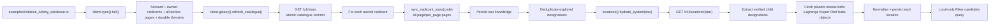

# Colony Initializer Flow

```mermaid
flowchart LR
    A["examples/initialize_colony_database.rs"] --> B["client.sync().full()"]
    B --> C["Account + owned replicants + all device pages + durable domains"]
    C --> D["client.galaxy().refresh_catalogue()"]
    D --> E["GET /v1/stars\natomic catalogue commit"]
    E --> F["For each owned replicant"]
    F --> G["sync_replicant_stars(code)\nall page/per_page pages"]
    G --> H["Persist star knowledge"]
    H --> I["Deduplicate explored designations"]
    I --> J["locations().hydrate_system(star)"]
    J --> K["GET /v1/locations/{star}"]
    K --> L["Extract verified child designations"]
    L --> M["Fetch planets moons belts Lagrange Kuiper Oort hubs objects"]
    M --> N["Normalize + persist each location"]
    N --> O["Local-only Riker candidate query"]
```
