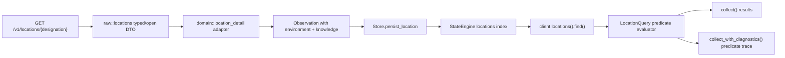

# Location Environment and Predicate Design Note

## Product motivation

The current story event asks players to identify distant settlement candidates using surveyed planet/moon data such as atmosphere, gravity, surface temperature, magnetic field, habitability context, and known life stage. The relevant details are obtained from `GET /v1/locations/{designation}` for planetary bodies.

## Contract warning

The checked-in 2.3.1 OpenAPI schema models several location subobjects as opaque JSON. The rendered location documentation and recent game changes provide richer fields than the generated raw model currently exposes. Implementation must therefore verify the current OpenAPI/rendered docs and add sanitized real-response fixtures before freezing field names or nesting.

Do not derive field names solely from the event prose. Do not discard unknown fields.

## Target public API

```rust
use replicant_client::{Atmosphere, LifeStage};

let candidates = client
    .locations()
    .find()
    .planetary_bodies()
    .surveyed()
    .has_atmosphere()
    .atmosphere_is(Atmosphere::Breathable)
    .has_magnetic_field()
    .in_habitable_zone()
    .life_stage_below(LifeStage::Intelligent)
    .gravity_g_above(0.8)
    .gravity_g_below(1.3)
    .surface_temp_c_above(10.0)
    .surface_temp_c_below(25.0)
    .collect()
    .await?;
```

Useful combined methods may also exist:

```rust
.gravity_g_between(0.8..=1.3)
.surface_temp_c_between(10.0..=25.0)
.without_advanced_civilisation()
.distance_from_sol_ly_above(20.0)
.order_by_distance_from_sol_desc()
```

## Semantics

- `collect()` is local-only and never performs hidden network I/O.
- Predicates requiring unavailable data reject `Unknown` by default.
- Unknown is not false.
- `surveyed()` requires the appropriate account-specific survey/deep-scan knowledge.
- `life_stage_below(Intelligent)` only evaluates known life knowledge. The implementation must define whether known “no life detected” matches; the recommended behavior is yes, while unknown life knowledge does not.
- Ordered life stages are the documented canonical sequence: prebiotic, microbial, complex, intelligent, spacefaring.
- Unknown future life-stage values remain preserved but do not participate in ordered comparisons until understood.
- Gravity methods use Earth gravities (`g`).
- Surface-temperature methods use Celsius and convert verified upstream units at normalization boundaries.
- `in_habitable_zone()` is not equivalent to “habitable.”
- `is_habitable()` is permitted only if the current contract exposes an explicit value with documented semantics.
- Location identity and query evaluation are realm-aware.
- Distance from SOL is derived by joining the location’s system to the durable star catalogue/coordinates; unknown coordinates do not match numeric distance predicates.

## Query diagnostics

For troubleshooting, add a local-only diagnostic form:

```rust
let report = query.collect_with_diagnostics().await?;
```

Each rejected location should report predicate outcomes such as:

```text
atmosphere_is(breathable): rejected (observed: thin)
magnetic_field: unknown
surface_temp_c_below(25): matched (observed: 18.4)
life_stage_below(intelligent): matched (observed: microbial)
```

This diagnostic path should reuse the exact predicate evaluator used by `collect()` so it cannot drift.

## Flow




## Newly observed Colony Survey ranking clues

Player-supplied Riker assessments dated 2026-07-26 identify additional likely ranking inputs:

- host-star spectral class or stability context;
- axial tilt / seasonal stability;
- rotation state and near-tidal locking;
- nearby asteroid-belt richness;
- ecosystem maturity and ethical burden.

These are **optional weighted-ranking facts**, not new hard predicates and not verified response-field names. Add typed fields and predicates only after confirming current authoritative location responses.

Recommended optional query/accessor vocabulary, only when verified:

```rust
.star_spectral_class(SpectralClass::K)
.axial_tilt_deg_below(15.0)
.rotation_state_is(RotationState::NearSynchronous)
.has_rich_belt_in_system()
```

For the example, prefer reading a committed `Location` snapshot and applying an explainable scoring function over chaining every bonus as a hard query. This preserves candidates such as an otherwise excellent near-tidally locked M-dwarf world.

Complex life must remain eligible under `life_stage_below(LifeStage::Intelligent)`; use a scoring caution rather than an automatic rejection.
