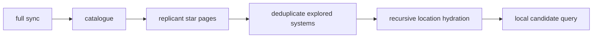

# Phase 11.6.01c — Colony database initializer

`examples/initialize_colony_database.rs` is a restart-safe, read-only database
initializer. It does not scan, travel, send BobNet messages, or submit a
candidate. Consequently, it cannot discover unsurveyed worlds.

## Public surface

- `Client::galaxy() -> GalaxyGateway`
- `GalaxyGateway::refresh_catalogue()` atomically replaces the persisted
  `GET /v1/stars` catalogue and returns `CatalogueReport`.
- `GalaxyGateway::sync_replicant_stars(code)` traverses every
  `GET /v1/replicants/{code}/stars` page and returns
  `ReplicantStarSyncReport`.
- `Client::locations().hydrate_system(star).all_known_objects()
  .max_locations(n).concurrency(n).run()` returns
  `LocationHydrationReport`.

## Traversal and authority

The example runs `sync().full()`, reads the locally committed owned replicants,
refreshes the global catalogue, and walks each owned replicant's paginated star
knowledge. The raw client routes `GET /v1/stars` through its dedicated
one-per-minute `StarCatalogue` bucket; ordinary safe reads use the shared read
bucket and honor server `Retry-After` metadata.

Catalogue replacement is one SQLite transaction: old rows remain intact if the
network request, normalization, or commit fails. `catalogue_metadata` retains
the server `generated_at` value. The state engine restores both catalogue rows
and replicant-specific observations from `replicant_star_knowledge` before
making local queries available.

Replicant star pages are bounded (default 1024), checked for monotonic page
numbers, committed page members individually, and never infer deletion from a
perspective-scoped response. Each observation records the owning replicant,
star designation, position, spectral type, entry point, exploration/life
knowledge, and distance/travel estimates when supplied.

## Verified child extraction

| Response field | Queued only when a child supplies `designation`, `location`, or `code` |
| --- | --- |
| `planets`, `moons`, `system_objects` | Yes |
| `asteroid_belt`, `belt`, `lagrange` | Yes |
| `kuiper`, `oort`, `outer_system`, `object`, `star` | Yes |
| `devices`, `resource_sites`, `shops` | Yes, if the documented object has an identity |
| counts such as `estimated_planets` and `moons_total` | Never |

The hydrator uses stable deduplication, cycle detection, explicit location and
depth caps, and a serial commit-before-next pipeline (therefore never exceeds
the configured concurrency bound). Successful details remain durable after a
later per-location failure; failures are returned in the report and reruns
merge the normal managed observations safely.

## Verification

Passed locally: `cargo fmt --all -- --check`, `cargo clippy --all-targets
--all-features -- -D warnings`, `cargo check --all-features --examples`,
`cargo test --all-features`, both example checks, rustdoc with warnings denied,
and the schema, authority, forward-compatibility, and remediation validators.

Changed files: `src/domain/model.rs`, `src/domain/adapters.rs`,
`src/managed/{client,galaxy,operation,state,store}.rs`, `src/lib.rs`,
`migrations/0001_initial.sql`, `policy/persistence-schema.json`, both colony
examples, this report, and the remediation validator inventory.
