# Replicant Client “Electronics Schematic” Mermaid Pack

This is a second-pass visual reference for the project, designed to feel closer to an **electronics diagram / service schematic** than a normal architecture overview.

The goal is that you can start from a public API call and trace it through:

- the public gateway,
- the managed layer,
- raw transport,
- domain normalization,
- persistence,
- in-memory state publication,
- events,
- sync/reconciliation,
- and durable operations.

Where useful, I embedded:

- **file names inside nodes**
- **function names on edges**
- **notes about whether the path is local-only, remote I/O, event-driven, or persistence-driven**

---

## 0. How to use this pack

### Recommended reading order

1. **Giant system diagram** — overall map of the whole program.
2. **Per-surface diagrams** — account, devices, replicants, events, sync, operations, simulations, etc.
3. **Targeted troubleshooting flow** — especially the `without_adopted_devices()` trace.

### Debugging rule of thumb

When something fails, classify it first:

- **Local query problem**
- **Managed read problem**
- **Raw transport problem**
- **Event propagation problem**
- **Sync/reconciliation problem**
- **Operation journal / mutation problem**
- **Persistence / publication problem**
- **Realm separation problem**

That will tell you which diagram to start with.

---

## 1. Legend

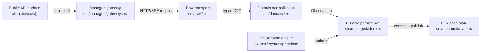

---

## 2. Giant system diagram

This is the “big board” view of the whole app.

```mermaid
flowchart LR
    subgraph PUBLIC["Public API surface — src/lib.rs + src/managed/client.rs"]
        Client["Client\nsrc/managed/client.rs\nClient::builder()\nClientBuilder::start()"]
        API_Account["account()\nAccountGateway"]
        API_Devices["devices()\nDevicesGateway"]
        API_Replicants["replicants()\nReplicantsGateway"]
        API_Directory["directory()\nDirectoryGateway"]
        API_Inventory["inventory()\nInventoryGateway"]
        API_Messages["messages()\nMessagesGateway"]
        API_Locations["locations()\nLocationsGateway"]
        API_LocEvents["location_events()\nLocationEventsGateway"]
        API_Bobnet["bobnet()\nBobnetGateway"]
        API_Trading["trading()\nTradingGateway"]
        API_Sim["simulations()\nSimulationsGateway"]
        API_Events["events()\nEventsGateway"]
        API_Sync["sync()\nSyncClient"]
        API_Raw["raw()\nraw::Client escape hatch"]
    end

    subgraph MANAGED["Managed orchestration layer"]
        Gateways["Read gateways + handles\nsrc/managed/gateways.rs\nget() list() refresh()\nfind().collect() watch()"]
        Operations["Durable operations\nsrc/managed/operation.rs\ncreate() resolve_awaiting_evidence()\nOperation::watch() Operation::outcome()"]
        EventEngine["Event engine\nsrc/managed/events.rs\nspawn() run_startup()\ncatch_up_unfiltered() run_sse_loop()\napply_event()"]
        SyncEngine["Sync engine\nsrc/managed/sync.rs\nSyncClient::essential()\nSyncClient::full()\nSyncClient::run()"]
        TradingManaged["Trading helpers\nsrc/managed/trading.rs"]
        SimManaged["Simulation helpers\nsrc/managed/simulations.rs\nstart() seed_realm() abandon()"]
        TravelManaged["Travel builder\nsrc/managed/travel.rs"]
        AmiManaged["AMI helpers\nsrc/managed/ami.rs"]
    end

    subgraph DOMAIN["Normalization + authority"]
        DomainCore["src/domain/mod.rs\nmodel.rs ids.rs vocab.rs"]
        DomainAdapters["src/domain/adapters.rs\naccount_me()\ndevice_detail()\ndevice_collection()\nowned_replicant_detail()\nlocation_detail()\nlocation_inventory()\nsimulation_start()\naccount_event()"]
        DomainQuery["src/domain/query.rs + merge.rs\nDevicePredicate\nmerge rules"]
        Observation["Observation<T>\nObservationMetadata\nsource authority observed_at"]
    end

    subgraph STATE["State + persistence"]
        StateEngine["src/managed/state.rs\nStateEngine\nStateSnapshot\npersist_*()\npublish()\nsubscribe()"]
        Store["src/managed/store.rs\nStore\nSQLite tables\nrestore_*() persist_*()\nevent cursor\noperation journal\nreconciliation queue"]
    end

    subgraph RAW["Raw transport"]
        RawClient["src/raw/client.rs\nraw::Client\nrequest executor\nrate-limit hooks"]
        RawAccounts["src/raw/accounts.rs"]
        RawDevices["src/raw/devices.rs"]
        RawReplicants["src/raw/replicants.rs"]
        RawEvents["src/raw/events.rs + src/events.rs"]
        RawLocations["src/raw/locations.rs\nsrc/raw/location_events.rs"]
        RawInventory["src/raw/inventory.rs"]
        RawTrading["src/raw/trading.rs"]
        RawSims["src/raw/simulations.rs"]
        RawBobnet["src/raw/bobnet.rs"]
        RawMessages["src/raw/messages.rs"]
    end

    subgraph EXTERNAL["External systems"]
        HTTP["Replicant Space HTTP API"]
        SSE["Replicant Space SSE stream"]
        DB[("SQLite database")]
    end

    Client -->|"account()"| API_Account
    Client -->|"devices()"| API_Devices
    Client -->|"replicants()"| API_Replicants
    Client -->|"directory()"| API_Directory
    Client -->|"inventory()"| API_Inventory
    Client -->|"messages()"| API_Messages
    Client -->|"locations()"| API_Locations
    Client -->|"location_events()"| API_LocEvents
    Client -->|"bobnet()"| API_Bobnet
    Client -->|"trading()"| API_Trading
    Client -->|"simulations()"| API_Sim
    Client -->|"events()"| API_Events
    Client -->|"sync()"| API_Sync
    Client -->|"raw()"| API_Raw

    API_Account -->|"get() refresh()"| Gateways
    API_Devices -->|"get() list() find() cached()"| Gateways
    API_Replicants -->|"get_owned() find()"| Gateways
    API_Directory -->|"replicant() search()"| Gateways
    API_Inventory -->|"for_replicant() / account inventory reads"| Gateways
    API_Messages -->|"mark_read()"| Operations
    API_Locations -->|"contribute()"| Operations
    API_LocEvents -->|"list() resolve()"| Operations
    API_Bobnet -->|"relay + watch paths"| TradingManaged
    API_Trading -->|"create() delete() fulfill()"| TradingManaged
    API_Sim -->|"start() active() scenarios() abandon()"| SimManaged
    API_Events -->|"watch()"| EventEngine
    API_Sync -->|"essential() full() domain() run()"| SyncEngine
    API_Raw -->|"direct raw service access"| RawClient

    Gateways -->|"normalize responses"| DomainAdapters
    TradingManaged -->|"delegates to operation helpers + raw"| Operations
    SimManaged -->|"delegates to operation helpers + realm seeding"| Operations
    SimManaged -->|"seed_realm()"| DomainAdapters
    TravelManaged -->|"preview() depart()"| Operations
    AmiManaged -->|"controller directives"| Operations

    Gateways -->|"persist_*()"| StateEngine
    Operations -->|"journal ops + status changes"| StateEngine
    EventEngine -->|"apply_event() / enqueue_reconciliation()"| StateEngine
    SyncEngine -->|"persist_*() + reconcile_owned_devices()"| StateEngine

    StateEngine -->|"persist_* / restore_*"| Store
    Store --> DB

    Gateways -->|"managed_raw().*.call()"| RawClient
    Operations -->|"typed unsafe mutation"| RawClient
    EventEngine -->|"events().list()"| RawClient
    EventEngine -->|"events().stream()"| RawClient
    SyncEngine -->|"list/detail REST reads"| RawClient

    RawClient --> RawAccounts
    RawClient --> RawDevices
    RawClient --> RawReplicants
    RawClient --> RawEvents
    RawClient --> RawLocations
    RawClient --> RawInventory
    RawClient --> RawTrading
    RawClient --> RawSims
    RawClient --> RawBobnet
    RawClient --> RawMessages

    RawAccounts -->|"HTTP"| HTTP
    RawDevices -->|"HTTP"| HTTP
    RawReplicants -->|"HTTP"| HTTP
    RawEvents -->|"HTTP log"| HTTP
    RawEvents -->|"SSE"| SSE
    RawLocations -->|"HTTP"| HTTP
    RawInventory -->|"HTTP"| HTTP
    RawTrading -->|"HTTP"| HTTP
    RawSims -->|"HTTP"| HTTP
    RawBobnet -->|"HTTP"| HTTP
    RawMessages -->|"HTTP"| HTTP

    RawClient -->|"DTO"| DomainAdapters
    DomainCore --> DomainAdapters
    DomainQuery --> Gateways
    DomainAdapters -->|"Observation<T>"| Observation
    Observation -->|"commit"| StateEngine
    StateEngine -->|"publish snapshot revision"| Gateways
    StateEngine -->|"subscribe() / watch()"| EventEngine
```

---

## 3. Client lifecycle and startup diagram

Use this when debugging startup, readiness, restore-only mode, or shutdown.

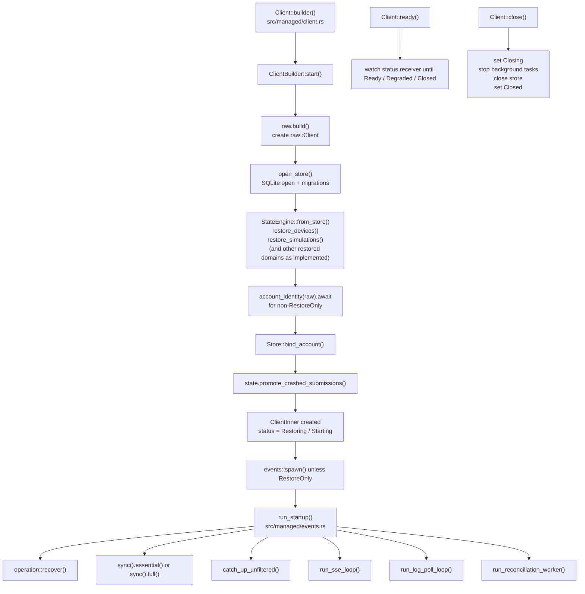

---

## 4. Account surface diagram

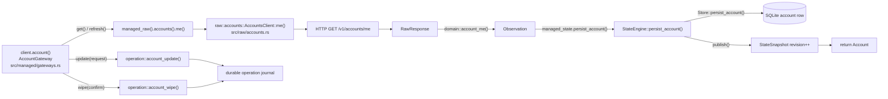

### What to inspect if account reads fail

- `src/managed/gateways.rs` — `AccountGateway::get`
- `src/raw/accounts.rs` — raw account method
- `src/domain/adapters.rs` — `account_me()`
- `src/managed/state.rs` — `persist_account()`
- `src/managed/store.rs` — `persist_account()`

---

## 5. Devices surface diagram — managed reads and local queries

### 5A. Managed device detail / list flow

```mermaid
flowchart LR
    A["client.devices()\nDevicesGateway"] -->|"get(code)"| B["managed_raw().devices().get(code)"]
    A -->|"list(query)"| C["managed_raw().devices().list(query)"]

    B --> D["raw::devices::DevicesClient::get"]
    C --> E["raw::devices::DevicesClient::list"]
    D --> F["HTTP GET /v1/devices/{device_code}"]
    E --> G["HTTP GET /v1/devices"]

    F --> H["Raw detail DTO"]
    G --> I["Raw collection DTO"]

    H -->|"domain::device_detail()"| J["Observation<Device>"]
    I -->|"domain::device_collection()"| K["Vec<Observation<Device>> + collection metadata"]

    J -->|"persist_devices()"| L["StateEngine::persist_devices()"]
    K -->|"persist_devices()"| L
    K -->|"if full unfiltered traversal"| M["reconcile_owned_devices()"]

    L --> N["Store::persist_devices()"]
    M --> O["Store::reconcile_owned_devices()"]
    N --> P[("SQLite devices table")]
    O --> P
    L --> Q["publish new snapshot"]
    Q --> R["return DeviceHandle or Vec<DeviceHandle>"]
```

### 5B. Local device query flow

```mermaid
flowchart LR
    A["client.devices().find()\nclient.devices().miners()\nclient.devices().controllers(type)"] --> B["DeviceQuery builder\nsrc/managed/gateways.rs"]
    B --> C["predicate state\nDevicePredicate + extra filters"]
    C --> D["collect() or subscribe()"]
    D --> E["managed_state().devices()\nlocal committed snapshot only"]
    E --> F["DeviceQuery::matching_entries()"]
    F --> G["predicate.matches()\nrealm type status access features commands location"]
    G --> H["extra filters\ntags system attached_to controller hosted_by"]
    H --> I["without_adopted_devices()\nscan other devices' relationships.controller"]
    I --> J["stable key-sorted map"]
    J --> K["handles() => Vec<DeviceHandle>"]
```

### 5C. Focused `without_adopted_devices()` trace

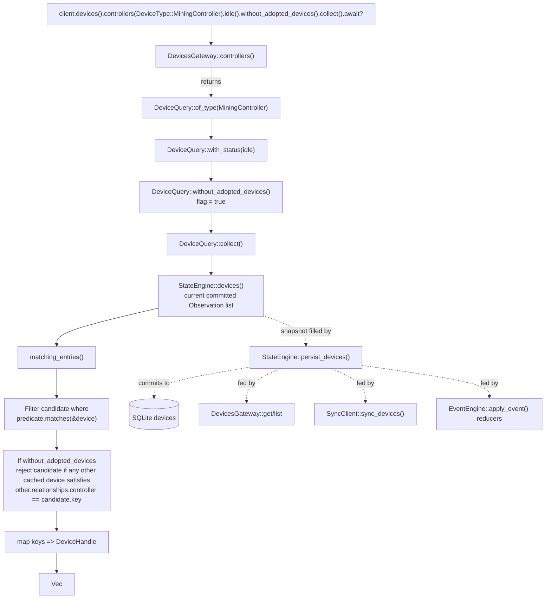

### If `without_adopted_devices()` misbehaves, inspect

- `src/managed/gateways.rs`:
  - `DeviceQuery::without_adopted_devices`
  - `DeviceQuery::matching_entries`
- `src/domain/adapters.rs`:
  - `device_detail()`
  - `device_collection()`
- event reducers that may alter `relationships.controller`
- sync/device list hydration correctness
- stale state vs current API truth

---

## 6. Replicants surface diagram

```mermaid
flowchart LR
    A["client.replicants()\nReplicantsGateway"] -->|"get_owned(code)"| B["managed_raw().replicants().get(code)"]
    B --> C["raw::replicants::ReplicantsClient::get"]
    C --> D["HTTP GET /v1/replicants/{code}"]
    D --> E["Raw replicant DTO"]
    E -->|"domain::owned_replicant_detail()"| F["Observation<Replicant>"]
    F -->|"managed_state.persist_replicant()"| G["StateEngine::persist_replicant()"]
    G -->|"Store::persist_replicant()"| H[("SQLite replicants table")]
    G -->|"publish()"| I["StateSnapshot revision++"]
    I --> J["return ReplicantHandle"]

    A -->|"find().collect()"| K["ReplicantQuery\nlocal-only"]
    K --> L["managed_state().replicants()"]
    L --> M["filter by realm access status location"]
    M --> N["Vec<ReplicantHandle>"]

    J -->|"update() message() mine() print() scan() teleport() transfer() cancel_travel()"| O["operation::* helpers"]
    J -->|"travel()"| P["TravelBuilder\nsrc/managed/travel.rs"]
```

---

## 7. Directory + inventory + messages + locations surface diagram

```mermaid
flowchart TB
    subgraph Directory["DirectoryGateway — src/managed/gateways.rs"]
        D1["client.directory().replicant(code)"] --> D2["managed_raw().replicants().get(code)"]
        D2 --> D3["domain::public_replicant_detail()"]
        D1b["client.directory().search(query)"] --> D4["managed_raw().replicants().list(query)"]
        D4 --> D5["domain::directory_profile()"]
    end

    subgraph Inventory["InventoryGateway — src/managed/gateways.rs"]
        I1["client.inventory().for_replicant(code)"] --> I2["managed_raw().inventory().for_replicant(code)"]
        I2 --> I3["domain::location_inventory()"]
        I3 --> I4["managed_state.persist_inventory()"]
        I4 --> I5[("SQLite inventory tables")]
    end

    subgraph Messages["MessagesGateway — src/managed/operation.rs"]
        M1["client.messages().mark_read(request)"] --> M2["operation::create('messages_mark_read', ...)" ]
        M2 --> M3["durable operation engine"]
    end

    subgraph Locations["LocationsGateway + LocationEventsGateway — src/managed/operation.rs"]
        L1["client.locations().contribute(designation, devices)"] --> L2["operation::create('location_contribute', ...)" ]
        LE1["client.location_events().list(location_code, status)"] --> LE2["managed_raw().location_events().list(...)" ]
        LE2 --> LE3["raw location event DTOs returned"]
        LE4["client.location_events().resolve(location_code, designation)"] --> LE5["operation::create('location_event_resolve', ...)" ]
    end
```

---

## 8. Event engine diagram

This is the main diagram to use when something happened in-game and the client did not react properly.

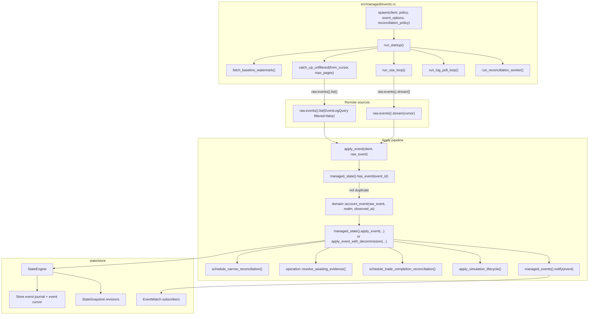

### If event handling is wrong, inspect in this order

1. `run_sse_loop()` and `catch_up_unfiltered()`
2. `apply_event()`
3. `domain::account_event()`
4. `StateEngine::apply_event()` / decommission logic
5. operation evidence resolution
6. reconciliation scheduling
7. simulation lifecycle hooks

---

## 9. Sync and reconciliation diagram

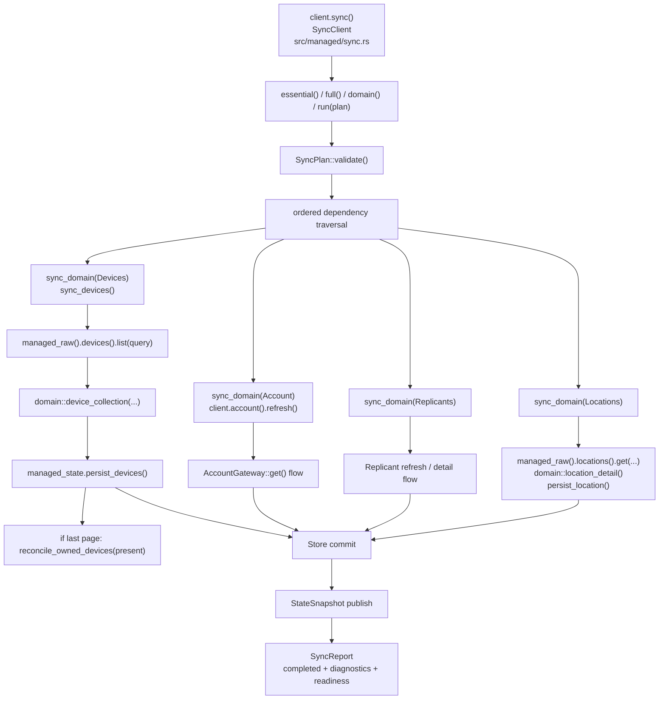

### Use this when

- `client.sync().full()` does not do what you expect
- a baseline appears incomplete
- a collection did not reconcile correctly
- readiness/status seem inconsistent with actual synchronized data

---

## 10. Durable operations diagram

This is the main “unsafe mutation” schematic.

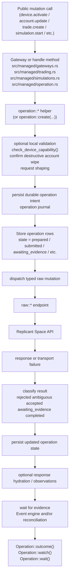

### Important associated files

- `src/managed/operation.rs`
- `src/managed/events.rs` — because events can resolve operations
- `src/managed/state.rs` / `store.rs` — because operations are durable
- `src/raw/*` — because the final dispatch goes through typed raw endpoints

---

## 11. Simulations and realm flow diagram

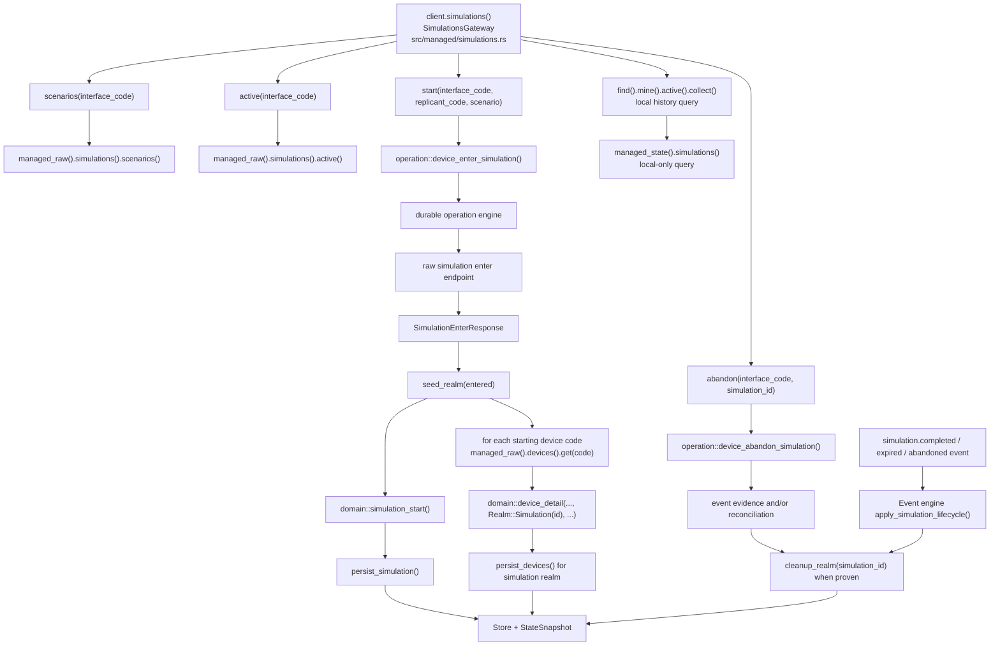

### If simulation behavior is wrong, inspect

- `SimulationsGateway::start`
- `seed_realm()`
- `cleanup_realm()`
- realm assignment on events
- whether state is in `Realm::Live` vs `Realm::Simulation(id)`

---

## 12. State and persistence core diagram

Use this when you suspect that “the API call succeeded but the local client view is wrong.”

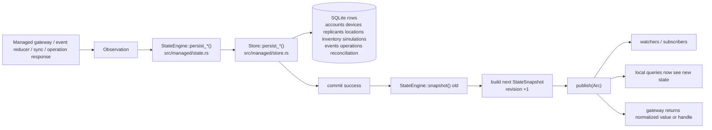

### Where to inspect

- `src/managed/state.rs`
- `src/managed/store.rs`
- migrations under `migrations/`
- subscriber consumers in gateways/events/operations

---

## 13. Raw transport escape-hatch diagram

This is for debugging the raw layer separately from the managed layer.

```mermaid
flowchart LR
    A["client.raw()\nraw::Client"] --> B["service client\naccounts/devices/replicants/events/...\nsrc/raw/*.rs"]
    B --> C["request builder\nmethod path query body auth"]
    C --> D["rate limit coordination\nsrc/raw/rate_limit.rs"]
    D --> E["HTTP request executor\nsrc/raw/client.rs"]
    E --> F["Replicant Space API"]
    F --> G["HTTP response"]
    G --> H["status classification + error mapping"]
    H --> I["typed DTO deserialize"]
    I --> J["RawResponse<T>"]
```

### Use this path when

- managed and raw behavior differ
- DTOs fail to parse
- request metadata/path/query/body seems wrong
- rate-limit handling seems wrong

---

## 14. Troubleshooting matrix by public surface

| Public surface | Start here | Then inspect | Common failure class |
|---|---|---|---|
| `client.account()` | `AccountGateway::get` | raw accounts -> `domain::account_me` -> `persist_account` | managed read/persist |
| `client.devices().get()` | `DevicesGateway::get` | raw devices get -> `device_detail` -> `persist_devices` | managed read |
| `client.devices().list()` | `DevicesGateway::list` | raw devices list -> `device_collection` -> `persist_devices` -> reconcile | managed collection |
| `client.devices().find()` | `DeviceQuery::collect` | `matching_entries` -> current snapshot | local query |
| `without_adopted_devices()` | `matching_entries` | controller relationships in snapshot | local query / stale state |
| `client.replicants().get_owned()` | `ReplicantsGateway::get_owned` | raw replicants get -> `owned_replicant_detail` -> persist | managed read |
| `client.directory()` | `DirectoryGateway` | raw replicants get/list -> public normalization | public directory logic |
| `client.events().watch()` | event engine | catch-up/SSE -> `apply_event` -> journal/reduce | event propagation |
| `client.sync().full()` | `SyncClient::run` | `sync_domain` -> state -> readiness/report | sync / readiness |
| mutation calls | operation helper | journal -> raw dispatch -> evidence -> state | durable operation |
| `client.simulations()` | `SimulationsGateway` | start/seed/cleanup + events + realm | realm isolation |
| `client.raw()` | raw client | request build -> HTTP -> DTO decode | transport |

---

## 15. Suggested next follow-up

If you want to go even further, the next useful artifact would be a **file-and-function indexed troubleshooting guide**, where each subsystem gets:

- inputs
- outputs
- primary structs
- primary functions
- upstream dependencies
- downstream side effects
- likely failure symptoms
- exact files to inspect first

That would be the closest thing to a **service manual** for the codebase.

---

## Added Phase 11.6 location environment and predicate flow

```mermaid
flowchart LR
    A["Full sync or explicit LocationsGateway::get"] --> B["raw::locations GET /v1/locations/{designation}"]
    B --> C["Verified typed + open location DTO"]
    C --> D["domain location adapter\nnormalize atmosphere gravity temperature magnetic field life knowledge"]
    D --> E["Observation<Location>\nrealm + authority + knowledge state"]
    E --> F["Store.persist_location"]
    F --> G["StateEngine location index + revision"]
    G --> H["client.locations().find()"]
    H --> I["LocationQuery evaluator"]
    I --> J["planetary_bodies surveyed atmosphere magnetic habitable-zone life gravity temp distance predicates"]
    J --> K["collect() local results"]
    J --> L["collect_with_diagnostics()\nmatched rejected unknown per predicate"]
```
